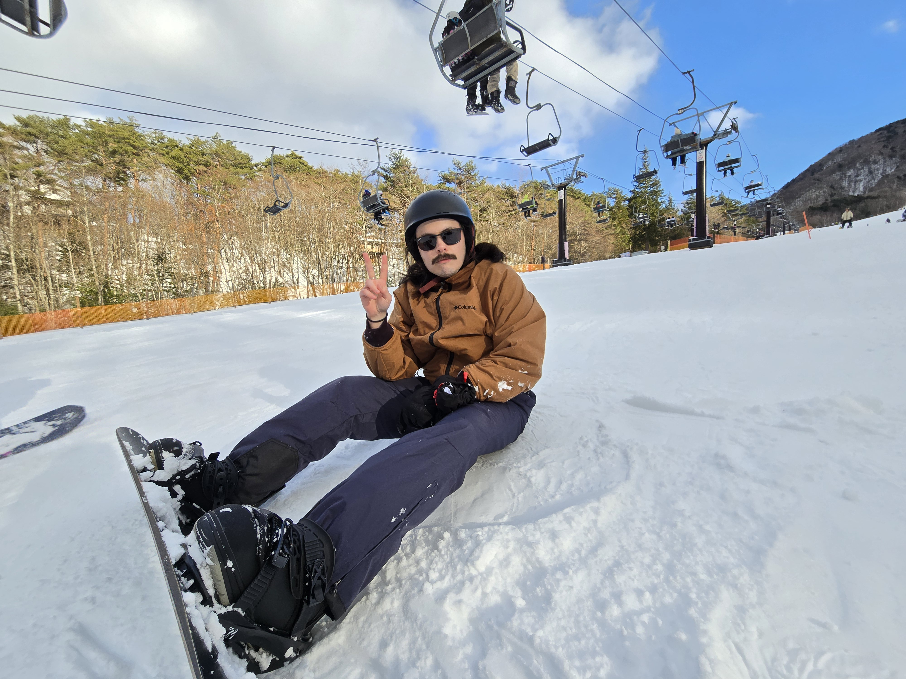
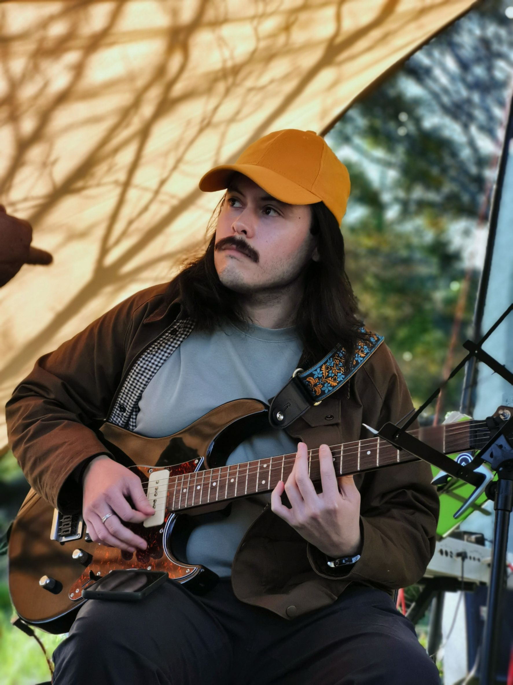

<!-- TODO: -->
<!-- que esta pagina sea para parrafitos de introduccion(mini statement of purpose) -->
<!-- poner mas info de lo k hice en yamaha interphace y EQ6-->
<!-- poner mas info de hoobies y my personalidad y el dist mxr-->
<!-- link al cv (en formato markdown o nommas el pdf) -->

## Jorge Alejandro Zúñiga Bejarano  

- [About Me](#about-me)
- [Research Interests](#research-interests)
- [Professional Experience](#professional-experience)
- [Selected Projects](#selected-projects)
- [Publications & Presentations](#publications--presentations)
- [Hobbies & Interests](#hobbies--interests)
- [Contact](#contact)
<!-- *(Alex Zuni)*   -->

---
 

---

## 📫 Contact {#contact}

- 📧 **jorgealejandrozb@gmail.com**  
- 📄 [CV (PDF)](assets/Alex%20CV%20PHD.pdf)

---

## About Me

I’m currently a DSP Software Engineer at Yamaha Corporation in Japan, where I develop and optimize real-time audio effects for professional mixing consoles. I am engineer exploring how technology shapes the way we create and experience sound. My background blends electronics, signal processing, and creative coding, and my goal is to design tools that make high-quality sound creation more expressive and accessible. I’m applying to PhD programs in Music Technology, aiming to research real-time sound synthesis, physical modeling, and intelligent audio systems that bridge artistry and engineering. I think the most meaningful sound technologies are those that democratize creativity making expression accessible to everyone.

---

## Research Interests

I’m motivated by  the need for democratizing professional-level audio. There have to be better solutions that can make complex workflows accessible to musicians, creators, and everyday users in the same way computational photography did for images.
I want to create tools and algorithms that enable working musicians and non-experts alike to access high-fidelity, professionally balanced audio. I would like to be able to reduce the technical barrier to great sound and to integrate perceptual models into practical, real-time systems.

- Audio signal processing (perceptual models, loudness-aware systems)  
- Sound synthesis & physical modeling  
- Machine learning for audio (practical/real-time applications)  
- Real-time DSP & embedded constraints  
- Cognitive/perceptual audio and procedural sound design

---

## Professional Experience

After graduating my Masters I did a 3 month internship and subsequently have spent 5 years working at Yamaha Professional Audio in Hamamatsu with the DSP team on development and maintenance of audio effects for digital mixing consoles and other platforms. I was the main developer for Interphase and DynamicEQ6, responsible for the DSP algorithms (mainly C++), GUI design, and implementing on SHARC and Yamaha DSP chips, ensuring cross-platform compatibility across consoles and operating systems.

### Interphase (RIVAGE PM Series)
Interphase is a phase/alignment tool used to align and shape the tone of microphones and pickups (e.g., bass mic vs line, snare front/back).  
**Features & role:**  
- Implements Delay, Polarity, and a phase-filter (all-pass) to let engineers adjust phase by frequency to alter timbre.  
- Visual waveform capture for main and reference signals, plus a correlation meter for agreement between signals.  
- **Align** function auto-sets Delay Time and Polarity.  
- I was responsible for DSP and GUI across platforms (SHARC, Windows/Mac tools).  
- **Constraints/Challenges solved:** real-time safety, cross-platform consistency, and tight DSP budgets on older hardware.

### DynamicEQ6 (RIVAGE PM Series)
DynamicEQ6 is a six-band dynamic equalizer that extends previous Yamaha dynamic EQ designs. It combines static gain with dynamic range control, adds HP/LP filters per band, per-band key-in filters, an M/S option for the stereo version, and an automatic threshold function that derives a threshold from the incoming signal.  
**Features & role:**  
- Implemented the DSP pipeline for multi-band dynamic operation and precise phase management.  
- Built the visual metering and user interactions.  
- Implemented automatic threshold heuristics to help engineers set thresholds quickly.  
- Ensured performance and UX parity across Yamaha’s product line and generations.

**What I personally did:**  
- Full lifecycle: ideation, algorithm design, coding (DSP & GUI), debugging, and release.  
- Implemented assembly optimizations for critical processing blocks to meet strict DSP budgets improving processing load from 96% down to 5% on target hardware (~94.8% reduction).  
- Collaborated with an illustrator for GUI assets, consulted R&D, marketing, clients, and internal testers for feedback and QA.

  

    <iframe width="320" height="180" src="https://www.youtube.com/embed/8ndvYH2jZBM?start=134" title="YouTube video player" frameborder="0" allow="accelerometer; autoplay; clipboard-write; encrypted-media; gyroscope; picture-in-picture" allowfullscreen></iframe>
    <iframe width="320" height="180" src="https://www.youtube.com/embed/wu3lvcvCWwk" title="YouTube video player" frameborder="0" allow="accelerometer; autoplay; clipboard-write; encrypted-media; gyroscope; picture-in-picture" allowfullscreen></iframe>
  

 

---

## 📚 Publications & Presentations {#publications--presentations}

I had the pleasure of presenting the work I did with Professor Josh Reiss during my Masters at my first AES attendance as an Engineering Brief and paper. With the help and guidance of Professor Josh Reiss and fellow students we could present this project and add the paper to the AES library. Here are some details of the project:
- Developed a parametric model to emulate birdsong using fitted Bezier-curve shaped frequency/amplitude modulators.  
- Used Particle Swarm Optimization to fit model parameters to clean syllable excerpts sourced from the xeno-canto birdsong database.  
- Model performed well for many species and syllable types but struggled with noisy, high-harmonic sounds.  
- Shows how compact parametric models can replace large sample libraries for interactive audio and low-latency environments.

- [View Publication](https://aes2.org/publications/elibrary-page/?id=20578)
- [Try the model online](https://nemisindo.com/models/birds-real)
  - I recommend setting a preset and pressing the play button to listen.
- [Slides from AES presentation](https://docs.google.com/presentation/d/1jN4gJz_u_SNQ29tM2SL9W5E5qZ2NENw_JlOcnk9y8_w/edit?usp=sharing)

---

## Selected Projects

### 🥁 Embedded Drum Machine  
- Real-time embedded drum system using the BELA platform with piezo sensors for hit detection, loop editing, and simple on-board effects.  
- Implemented sample playback, looping, and reverb in C++.

    <iframe width="320" height="180" src="https://www.youtube.com/embed/rPZqWFPeOiA?si=HH8eOO35UYo5fWq0" title="YouTube video player" frameborder="0" allow="accelerometer; autoplay; clipboard-write; encrypted-media; gyroscope; picture-in-picture; web-share" referrerpolicy="strict-origin-when-cross-origin" allowfullscreen></iframe>
  

  

### 🎸 Eightyfier – 80’s Guitar Effect Plugin  
A **VST plugin** recreating classic 1980s guitar tones using multi-effects DSP.  
- [GitHub Repo](https://github.com/Alexzb8/Eightyfier)  
- [Technical Write-up](https://docs.google.com/document/d/1Bc7VeBnCKVataHoZVy_KxXeIfGjrFAlfoQkw9Zypl0E/edit?usp=sharing)  

### 🎚️ MXR Dist Pedal Clone  
A handmade guitar pedal clone of the classic MXR distortion pedal. Built from scratch, I was amazed by the rich, detailed harmonics from such a simple design. Currently exploring filtering techniques and working toward a dream pedal: a headphone-friendly, line-level output signal processor for apartment living without an amp. 

<audio src="/assets/videosAudio/allGain.mp3" controls>
Your browser does not support the audio tag.
</audio>

<audio src="/assets/videosAudio/highGain.mp3" controls>
Your browser does not support the audio tag.
</audio>

---

## ☕ Hobbies & Interests {#hobbies--interests}

### 🎸 Music & Instruments

Music has been a constant part of my life since I learned drums as a teenager; later, living in apartments led me to switch to guitar, which I now play daily. I started by listening to rock and blues but now I’m especially drawn to classic jazz ballads played by artists like Bill Evans, Chet Baker, and Louis Armstrong.

### 📸 Creative Hobbies

I enjoy photography mostly with my Fujifilm XT1 and documenting trips and everyday life in Japan. I also love cinema and reading; I gravitate toward fantasy, sci-fi, and classic literature.

### 🏔️ Lifestyle & Learning

I’m naturally curious and detail-oriented, and I enjoy keeping a clean, organized workspace. Hiking and road trips have become a favorite way to unwind. I’m also committed to continuing my Japanese studies, which has been one of the most challenging and rewarding parts of living abroad.

---

  

    
    
Some long exposure bracket photography in Hakone.

  

  

    
    
My second time snowboarding

  

  

    
    
Hiking the Japanese Chuo Alps

  
  
  

    
    
Playing my friend's Yamaha

  

  

    
    
Crochet cardigan I hand made for my partner

  

---

## 📫 Contact {#contact}

- 📧 **jorgealejandrozb@gmail.com**  
- 📄 [CV (PDF)](assets/Alex%20CV%20PHD.pdf)

---
