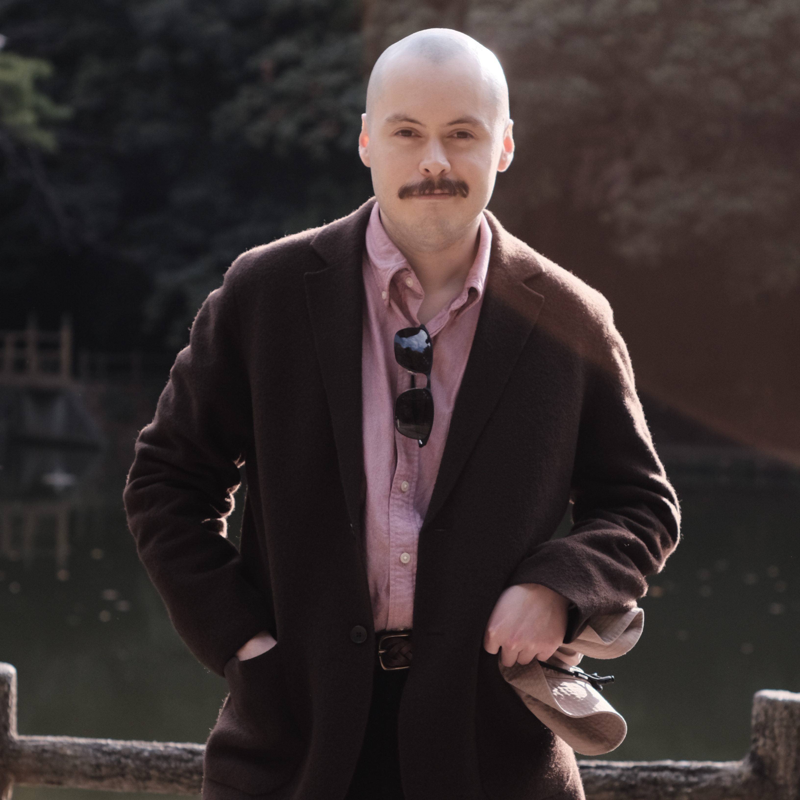

<!-- TODO: -->
<!-- que esta pagina sea para parrafitos de introduccion(mini statement of purpose) -->
<!-- poner mas info de lo k hice en yamaha interphace y EQ6-->
<!-- poner mas info de hoobies y my personalidad y el dist mxr-->
<!-- link al cv (en formato markdown o nommas el pdf) -->

## Jorge Alejandro Zúñiga Bejarano  

- [About Me](#about-me)
- [Research Interests](#research-interests)
- [Education](#education)
- [Professional Experience](#professional-experience)
- [Selected Projects](#selected-projects)
- [Publications & Presentations](#publications--presentations)
- [Hobbies & Interests](#hobbies--interests)
- [Contact](#contact)
<!-- *(Alex Zuni)*   -->

---
 

## About Me

Hi, I’m **Alejandro (Alex) Zúñiga**, an engineer and musician exploring how **technology shapes the way we create and experience sound**.  
I’m currently a **DSP Software Engineer at Yamaha Corporation** in Japan, where I develop and optimize real-time audio effects for professional mixing consoles.  

My background blends **electronics, signal processing, and creative coding**, and my goal is to design tools that make high-quality sound creation more expressive and accessible.  

I’m applying to **PhD programs in Music Technology**, aiming to research real-time sound synthesis, physical modeling, and intelligent audio systems that bridge artistry and engineering.

---

## Research Interests

- Audio Signal Processing  
- Sound Synthesis and Physical Modeling  
- Machine Learning for Audio  
- Real-Time DSP and Embedded Systems  
- Cognitive and Perceptual Audio  
- Procedural Sound Design  

---

## Education

**Queen Mary University of London** — *MEng Electronics with Music and Audio Systems*  
*2015 – 2019*  
- Graduated **First Class**  
- Research project: *Procedural sound synthesis of bird song using particle swarm optimisation*  
  - Published and presented at **AES 147 Convention (New York, 2019)**  
- Awards:  
  - *Third-Year Academic Achievement Prize*  
  - *1st Place, Design and Build Hackathon (2017)*  

---

## Professional Experience

**Yamaha Corporation** – *DSP Software Engineer*  
*Hamamatsu, Japan | Jan 2021 – Present*  
- Researched and implemented DSP algorithms for professional audio products.  
- Released **Interphase** and **DynamicEQ6** effects for the RIVAGE PM series.  
- Designed and optimized real-time audio effects systems in C/C++ and embedded DSP.  
- Collaborated with cross-division R&D teams and contributed to internal prototypes.  

After graduating my Masters I did a 3 month internship and subsequently have spent 4 years working at Yamaha Professional Audio in Hamamatsu with the DSP team on development and maintenance of audio effects for digital mixing consoles and other platforms. I was the main developer for **Interphase** and **DynamicEQ6** — responsible for the DSP algorithms (mainly C++), GUI design, and implementing on SHARC and Yamaha DSP chips, ensuring cross-platform compatibility across consoles and operating systems.

  

    <iframe width="320" height="180" src="https://www.youtube.com/embed/8ndvYH2jZBM?start=134" title="YouTube video player" frameborder="0" allow="accelerometer; autoplay; clipboard-write; encrypted-media; gyroscope; picture-in-picture" allowfullscreen></iframe>
    <iframe width="320" height="180" src="https://www.youtube.com/embed/wu3lvcvCWwk" title="YouTube video player" frameborder="0" allow="accelerometer; autoplay; clipboard-write; encrypted-media; gyroscope; picture-in-picture" allowfullscreen></iframe>
  

 
**AI Music (London, UK)** – *R&D Intern*  
*Jun 2018 – Sep 2018*  
- Developed ML-based adaptive music systems using Python and C++.  
- Applied digital signal processing and music information retrieval techniques.  

---

## Selected Projects

### 🎵 Birdsong Procedural Synthesis  
Developed a synthesis algorithm that models bird song using **Particle Swarm Optimization**, generating realistic imitations of multiple species.  
- [AES Paper 555 (2019)](https://aes2.org/publications/elibrary-page/?id=20578)  
- Presented at AES 147 Convention, New York.  

### 🥁 Embedded Drum Machine  
An interactive drum system using the **BELA embedded platform** with piezo sensors and loop editing features.  
Implemented real-time reverb and looping with C++.  

### 🎸 Eightyfier – 80’s Guitar Effect Plugin  
A **VST plugin** recreating classic 1980s guitar tones using multi-effects DSP.  
- [GitHub Repo](https://github.com/Alexzb8/Eightyfier)  
- [Technical Write-up](https://docs.google.com/document/d/1Bc7VeBnCKVataHoZVy_KxXeIfGjrFAlfoQkw9Zypl0E/edit?usp=sharing)  

### 🚗 CarSim (PureData + JavaScript)  
A web app that simulates environmental soundscapes using **granular synthesis** and real-time visual interaction.  
- [Demo](http://www.astecnologias.com/carsim/CARSIM.html)  
- [GitHub](https://github.com/Alexzb8/CarSim-PureData-JS)  

### 🕹️ Escape Game  
A point-and-click horror game built with JavaScript, combining audio design and interactive storytelling.  
- [Play Online](http://www.astecnologias.com/escapeGame/escapeGame.html)  
- [GitHub](https://github.com/Alexzb8/escapeGame)  

### 🎚️ MXR Dist Pedal Clone  
A handmade guitar pedal clone of the classic MXR distortion pedal. Built from scratch, I was amazed by the rich, detailed harmonics from such a simple design. Currently exploring filtering techniques and working toward a dream pedal: a headphone-friendly, line-level signal processor for apartment living without an amp. 

---

## 📚 Publications & Presentations {#publications--presentations}

**Zúñiga, J. & Reiss, J. D. (2019).**  
*Realistic Procedural Sound Synthesis of Bird Song Using Particle Swarm Optimization.*  
Audio Engineering Society, Paper 555.  
[View Publication →](https://aes2.org/publications/elibrary-page/?id=20578)

---

## ☕ Hobbies & Interests {#hobbies--interests}

### 🎸 Music & Instruments

I picked up **drums** as a teenager—my first instrument—and taught myself mostly by ear, playing rock and blues with school friends. During university, apartment living forced a creative pivot: I switched to **guitar** to keep music alive, and now I play daily. It's part of my routine, whether jamming with family or just exploring sounds alone.

In recent years I've grown into **jazz**, particularly ballads from the golden age (1950s–60s). I didn't grow up with it, but I'm grateful to live in an era where I can discover incredible artists like **Bill Evans**, **Chet Baker**, and **Louis Armstrong** anytime. While I play drums and guitar, these piano and trumpet masters inspire my listening.

### 📸 Creative Hobbies

I love **movies**, **reading**, and **photography**. Cinema has been a lifelong passion since childhood trips to the theater with my parents—I still go whenever something interesting releases. For books, I gravitate toward **fantasy** and **sci-fi** (George R. R. Martin's *A Song of Ice and Fire* universe captivates me), and lately I've been reading English classics like *Dracula* and *Frankenstein* on my e-reader.

After moving to Japan, I picked up a **Fujifilm XT1** camera and have been documenting trips and local parks ever since. Printing my favorite shots is my preferred way to preserve memories—there's something irreplaceable about physical prints.

### 🏔️ Personality & Adventure

I'd describe myself as **curious** and sometimes obsessively **detail-oriented**. A clean workspace helps me think clearly and dodge distractions. I genuinely believe I'll never be bored—there's always something new to learn or experience.

Since getting a car in Japan, I've explored hiking around nearby mountains, which has become a favorite escape. The blend of nature and the challenge of discovering new trails keeps me engaged.

### 🎚️ Guitar Pedal Building

This year I ventured into **guitar pedal building**. Starting with an **MXR Dist pedal clone**, I was immediately blown away—such a simple design yielded huge, harmonically rich sound. It sparked a passion I didn't expect.

My next builds will explore **filtering techniques** before and after the distortion stage. My dream pedal: a **line-level, headphone-friendly signal processor** I can plug my guitar into at home, eliminating the need for an amp and keeping my music-making flexible in apartment living.

### 📚 Language & Learning

I'm committed to continuing **Japanese** even after leaving Japan. It's brutally challenging but incredibly rewarding. The language opens doors to culture, relationships, and ways of thinking I'm eager to keep exploring.

---

## 📫 Contact {#contact}

- 📧 **jorgealejandrozb@gmail.com**  
- 🌐 [WordPress Blog](https://jorgezunigablog.wordpress.com/)  
- 💻 [GitHub Projects](https://github.com/AlexZuni)  

---

> “The most meaningful sound technologies are those that democratize creativity — making expression accessible to everyone.”

